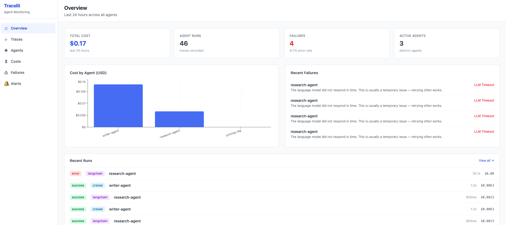
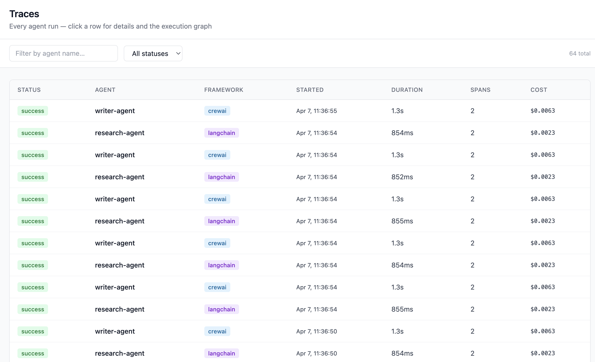
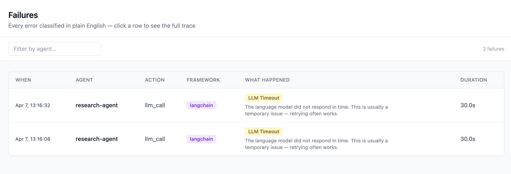
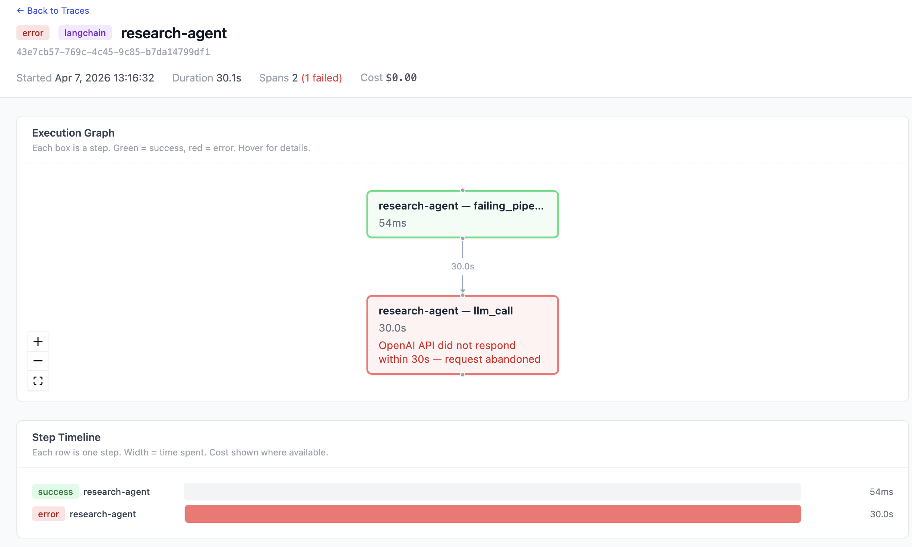

# Trace-lit

Observability for multi-agent AI pipelines.



---

## Quickstart

```bash
pip install "tracelit-sdk[kafka]"
```

```python
import trace_lit

trace_lit.configure(
    kafka_brokers=["app.trace-lit.com:9093"],
    api_key="sk-demo-abc123",  # public demo key — traces appear in the shared demo workspace
)

@trace_lit.trace(agent_name="my-agent", framework="langchain")
def run(query):
    ...
```

**[View dashboard →](https://app.trace-lit.com)**

---

## What you get

Every agent run is captured automatically — cost, failures, and the full execution graph.



Failures are classified in plain English, not error codes.



Click any trace to see the execution graph and step timeline.



---

## Test the connection

```bash
python3 -m trace_lit.quickstart --broker app.trace-lit.com:9093 --key sk-demo-abc123
# ✓ Connected to Trace-lit
# ✓ Test trace sent
# ✓ View at https://app.trace-lit.com
```

---

**Get access** — [contact us](mailto:hello@trace-lit.com) or open an issue.

MIT License
